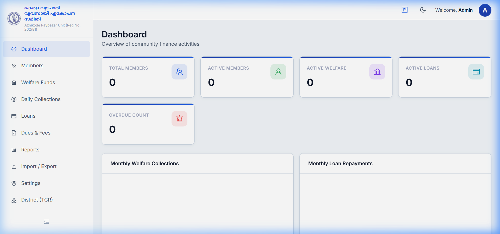
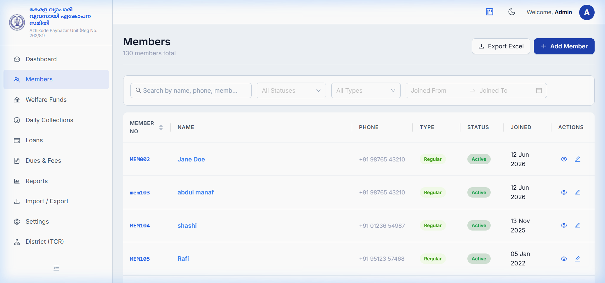
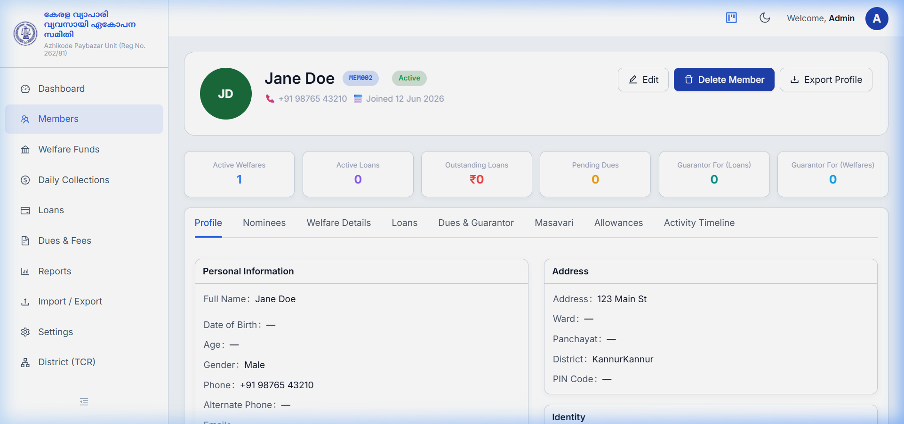
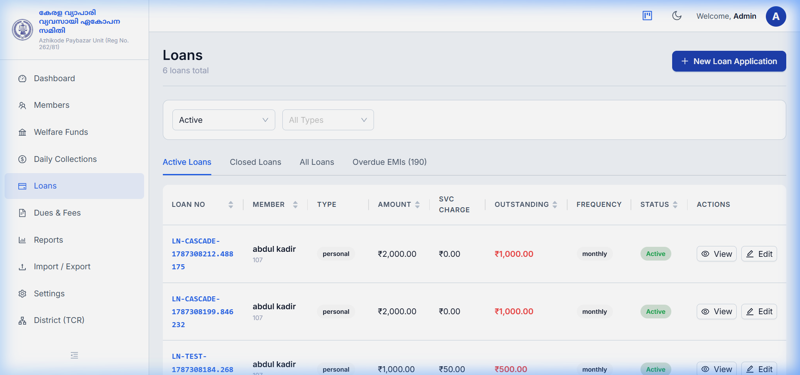
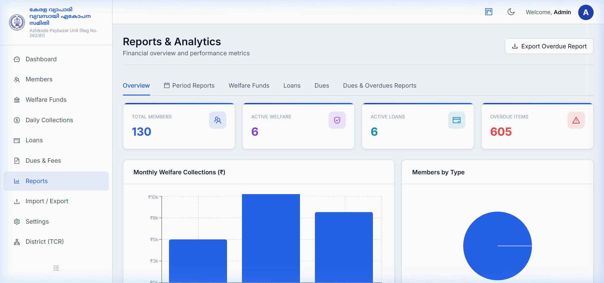

# KVVES Management System

> **Kerala Vyapari Vyavasayi Ekopana Samithi — Azhikode Paybazar Unit (Reg No. 262/81)**  
> Production-grade Community Finance, Member Directory, Welfare Funds, Loan Tracking, and Financial Analytics Platform.

---

## 📸 Screenshots & Showcase

### 1. Dashboard & Financial Overview
Real-time stat cards, overdue alerts, and monthly collection/repayment trend charts.


### 2. Member Management
Search, filter, and manage members with full Malayalam name support, status badges, and Excel export.


### 3. Detailed Member Financial Profile
Tabbed interface for personal details, nominees, active welfare funds, loan histories, and activity logs.


### 4. Loans & EMI Repayment Engine
Manage loan applications, automated amortization schedules, EMI collection, and principal/interest breakdowns.


### 5. Reports & Financial Analytics
Comprehensive analytics with period filtering, welfare collection metrics, member distribution pie charts, and overdue tracking.


---

## 🔒 Security & Confidentiality

This repository follows strict security and confidentiality guidelines to prevent sensitive or private data exposure:

- **Database Protection**: All local database files (`*.sqlite3`, `*.db`, `*.sql`, `*.dump`) and backup directories (`/backups/`) are strictly ignored in `.gitignore` and excluded from repository commits.
- **Environment Isolation**: Application secrets, JWT signing keys, and database credentials are managed exclusively via `.env` environment configuration files (never hardcoded in source control).
- **Access Control**: Role-Based Access Control (RBAC) with 3 privilege levels (*Admin*, *Staff*, *Viewer*) and JWT token rotation.

---

## 🛠️ Tech Stack

| Layer | Technology |
|-------|-----------|
| **Backend** | Python 3.11+ / Django 4.2 + Django REST Framework 3.15 |
| **Auth** | JWT Authentication (`rest_framework_simplejwt`) |
| **Database** | PostgreSQL 15 (Production) / SQLite (Development) |
| **Frontend** | React 18 + Vite 5 |
| **UI Framework** | Ant Design v5 |
| **State Management** | Redux Toolkit |
| **Data Visualization** | Recharts / Chart.js |
| **Production Server** | Waitress WSGI Server + Nginx (Windows) |

---

## 🚀 Quick Start

### 1. Prerequisites
- Python 3.11+
- Node.js 18+
- PostgreSQL 15 (or SQLite for local dev)

### 2. Backend Setup

```bat
cd backend

# Create virtual environment
python -m venv venv
venv\Scripts\activate

# Install dependencies
pip install -r requirements.txt

# Copy environment config
copy .env.example .env

# Run database migrations
python manage.py migrate

# Create initial superuser / seed data (optional)
python manage.py seed_data

# Start backend server
python manage.py runserver 127.0.0.1:8000
```

### 3. Frontend Setup

```bat
cd frontend

# Install node packages
npm install

# Start Vite development server
npm run dev
```

Open your browser at `http://localhost:5173`.

---

## 🔑 Default Credentials (Development)

| Role | Default Username | Default Password |
|------|------------------|------------------|
| **Admin** | `admin` | `kvva@admin2024` |
| **Staff** | `staff` | `kvva@staff2024` |
| **Viewer** | `viewer` | `kvva@view2024` |

> ⚠️ *Change default passwords immediately upon initial deployment!*

---

## ✨ Features

- 👥 **Member Directory**: Full member lifecycle, photo uploads, nominee records, address and Malayalam name search.
- 🤝 **Welfare & Chitty Funds**: Custom installment schedules, enrollment tracking, and winner records.
- 💰 **Loan Management**: Auto-calculated repayment schedules, EMI payment posting, penalty tracking, and loan closure.
- 📅 **Daily Collections & Masavari**: Advance payment splitting across months and atomic transaction reversals.
- 📊 **Reports & Export**: One-click Excel generation for member rosters, financial period reports, and overdue balances.
- 🛡️ **Audit Logging**: Comprehensive activity timeline for all financial modifications.

---

## ⚡ Production Deployment (Windows Host)

1. **Build Frontend**:
   ```bat
   cd frontend
   npm run build
   ```
2. **Start Production Backend Server**:
   ```bat
   cd backend
   python serve.py
   ```
3. **Serve Application via Nginx / Waitress Service**.

---

## 📄 License
Internal system developed for **Kerala Vyapari Vyavasayi Ekopana Samithi — Azhikode Paybazar Unit**. All rights reserved.
